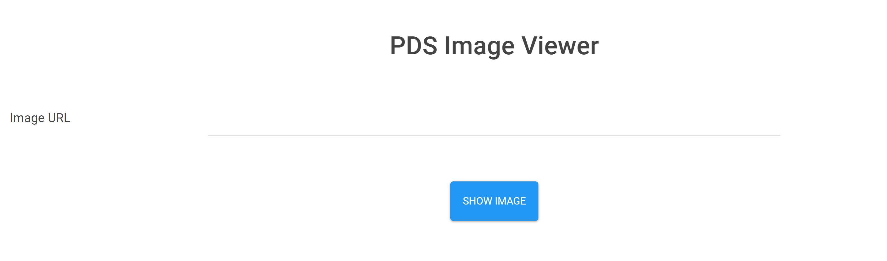
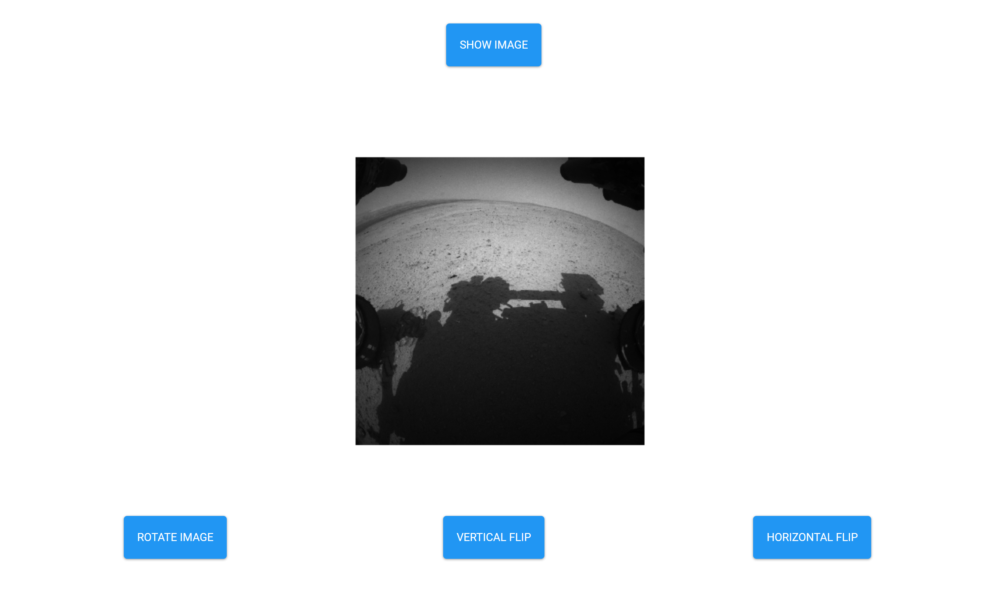

# Browser PDS Viewer App

Note this repo is not an official PDS app. I made this to practice making a
Flask app with an AngularJS front-end as well learning how to make and deploy an
application using Docker. This repo will not be actively maintained however I
may make updates as I add more complexity where I see I can learn something new.

## Run on Localhost
If you want to run on local host, switch the constants in app.py, start a redis
server, and then run app.py.

## Run on Docker
You can use the local docker-compose.yaml to run on a docker container. The only
requirement is that the manager machine has a ./data file. Here is the docker
image: [pbvarga1/pdsimage](https://hub.docker.com/r/pbvarga1/pdsimage/).

## The App

The home page looks like:

After putting an image URL in and selecting an image:

The image used in the example is: [FRB_431397159EDR_F0141262FHAZ00323M1.IMG](
https://pds-imaging.jpl.nasa.gov/data/msl/MSLHAZ_0XXX/DATA/SOL00382/FRB_431397159EDR_F0141262FHAZ00323M1.IMG)

It best works with smaller sized images (larger images can work but I've had
some problems).
